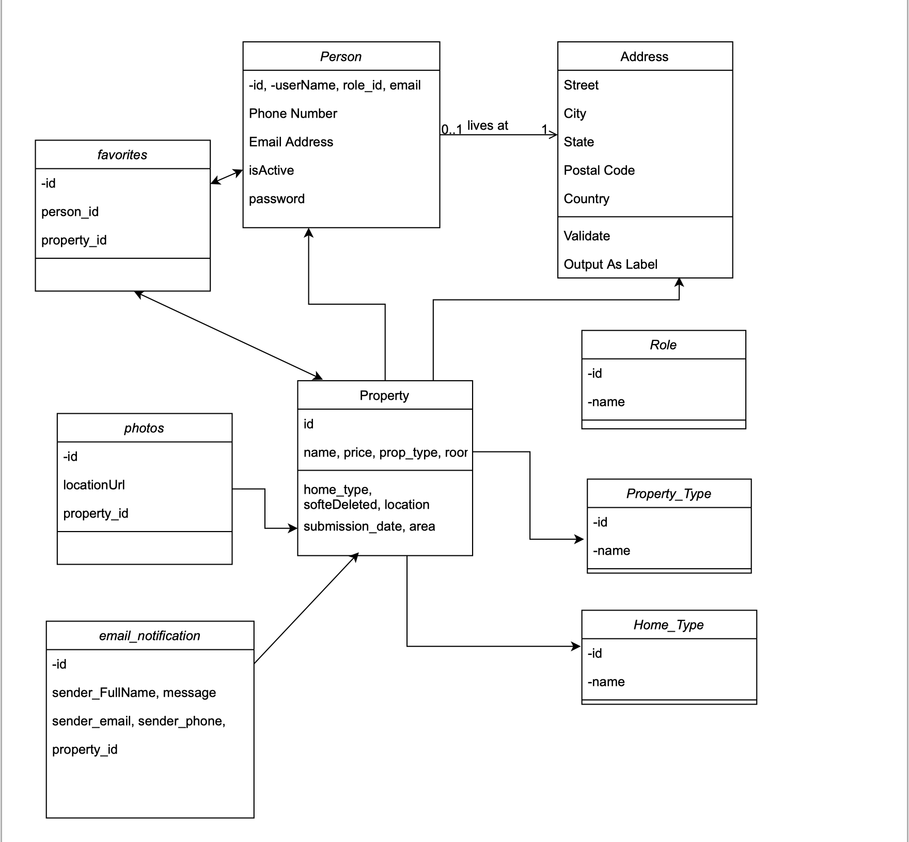

# WAA-Property-Management-Backend
Spring boot and React based portal where owners can list their properties for customers to rent or buy.

# Project Team Members: 
* Abedur Rahman
* Biniam Okbe Gebremichael
* Gebre Reda
* Kallol Shekhor
* Tewelle Welemariam (Project Manager)
* Henok GhebreGhergis

# Here is a link to a short demo video. [Video](https://youtu.be/3aKR6qgS9eo)

# ER Diagram 
# Front-end preview 
## Property Management Portal Requirements

 
Property management portal is a web-based java project where house owners and customers can exchange information effectively and inexpensively. This system provides a user-friendly interface, satisfying the needs of the consumers. 

To get a better understanding of the project, check out zillow.com.

There are four roles in this system: Owner, Admin, Customer, and Viewer.
 - The viewer is the user who can only search and display properties. (Unregistered users)  
 - The owner is the user who owns the property and wants it to give it for rent/sale. The owner will upload all the details of the property such as the number of rooms, price etc... 
 - Admin manages all the users of the system. 
 - Customer is the one who is looking for a property. She/He can search the properties according to the requirements and get the results accordingly and submit an application for the property.

Dashboard Page for admins:
- Display the last 10 properties rented.
- Display 10 most recent customers.
- Add more features as you see fit.

Dashboard Page for owners:
- Display properties.
- Display total views of the properties per location.
- Add more features as you see fit.

####  Functional  Requirements
--- 
* Owners/Customers can register to the system.
* Owners can add properties.
	* Can upload pictures of the property.
	* Optional: Use cloud services like Amazon S3 or Google Cloud Storage.
* Owners can see their own properties and manage them.
	* Can unlist, and edit the property.
* Owners and Customers can filter properties:
	* by price,
	* by property type,
	* by a number of rooms,
	* home type,
	* by location.
* Customers can submit an application to buy/rent the property.
	* Once an application is submitted, owner will get an email.
* Owners can display all applications and filter them
	* by property,
	* by submission date,
	* by location.
* Admin can manage customers and owners.
*  Admin can Activate/Deactivate customers and owners.
* Admin can reset passwords.
* Customers and owners can reset their password.
	* Users should follow a password reset link.
* Use [ECharts](https://echarts.apache.org/en/index.html) to create live charts for dashboards.
*   All delete operations should be a soft deletion.
* Customers can add properties to their favorite lists.
	* Customers can have multiple favorite lists.
* Customers can manage their own favorite lists.

#### Sample Domain Models
---
Refer to zillow.com

#### Technical Details
---
* Use Java and Spring Boot framework for the backend project.
* Use React framework for the frontend project.
* Use n-tier software architecture model.
* PostgreSQL is recommended as a Relational Database system.
* Populate your database with dummy data using `data.sql`.
	* Prepare your dummy data for testing and presentation.

#### Submission
---
* Submit a detailed project plan for your daily performance (day/task/time) and submit it with your code.
* Upload your work in one folder to the Sakai.
* Deadline: Saturday Oct 1 at 11:55 PM.
* Project will be evaluated based on your code quality. It is possible that I will need to schedule meetings with some students about their source-code.

#### Important Notes
---
 * You are not allowed to share codes with your classmates. If detected, you will get NC.
 
* Remember to respect the code honor submission policy. All written code must be original. Presenting something as one’s own work when it came from another source is plagiarism and is forbidden.
    
* Plagiarism is a very serious thing in all American academic institutions and is guarded against vigilantly by every professor.
 
